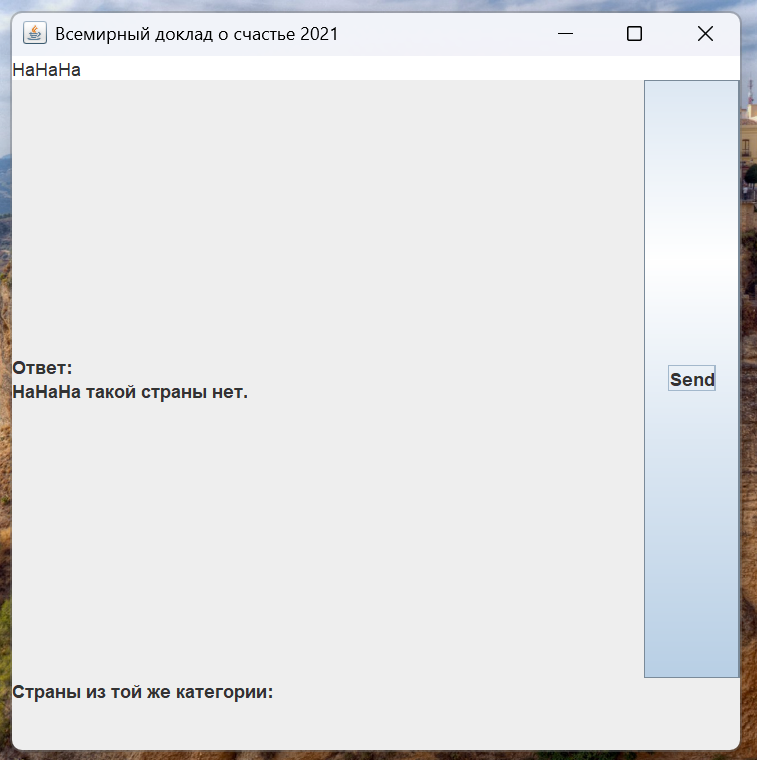

# happiness_in_countries

## ТЗ

Пользователь вводит страну. Вывести категорию, к которой относиться страна по уровню счастью граждан и 10 стран из той же категории.

### Категории стран:
- счастливые
- средние
- несчастные

# Реализация:
- Задача классификации проведена с использование KNN, написанного посредством процедур на MySQL  
[Реализация KNN](Implementation_of_KNN.md)
- Backend и Frontend написан на Java

## Что получилось:
- С правильными входными данными  

- С неправильными входными данными  

### Датасет взят с:
[World Happiness Report 2021 (kaggle.com)](https://www.kaggle.com/datasets/ajaypalsinghlo/world-happiness-report-2021/data)

